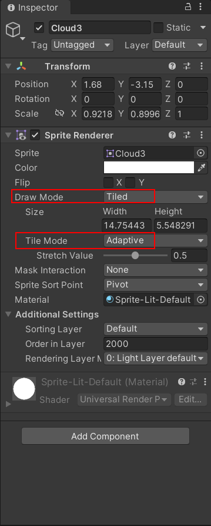
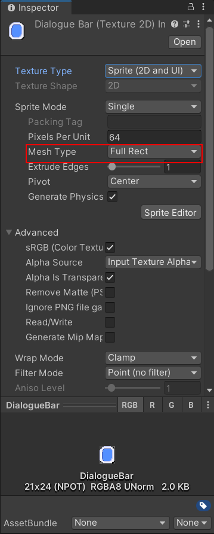

### 图像平铺

1. 在左侧层级视图中选择你需要平铺的Game Object对象，在右侧会出现检查员视图。

2. 选择：Transform 组件

   * 修改缩放属性`Scale` 确保在三个轴线上的缩放为 1，即平铺大小为1比1平铺

3. 选择：Sprite Renderer组件

   * 修改属性`Draw Mode` 为`Tiled` ，并且将`Tile Mode`设置成 `Adaptive`
   * 修改`Draw Mode` 为Tiled 之后，会出现警告弹框。打开该游戏对象的Sprite，将`Mesh Type`修改为`Full Rect`即可解决。

4. 操作截图

   ​	

   