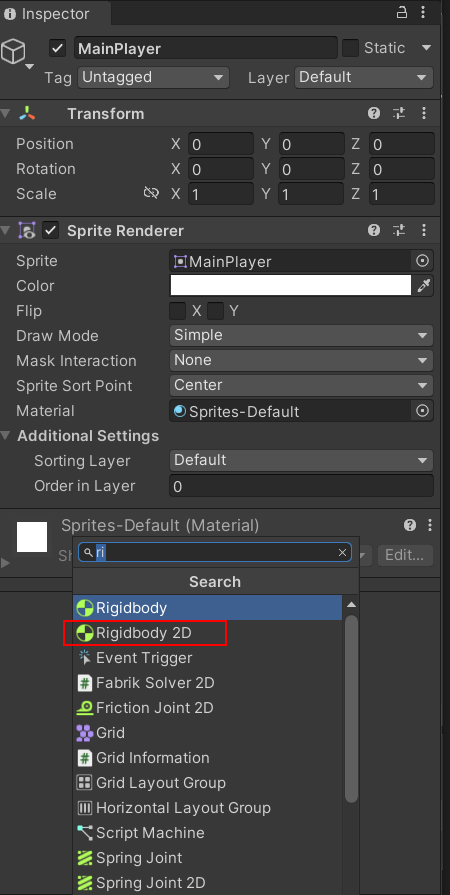
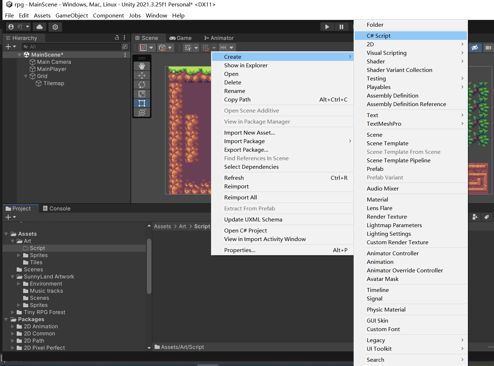

### 移动脚本

​	实现`sprite`移动的方式有两种：

  * 在游戏运行时，通过Update函数。给定一个移动速度。获取每帧内在水平和垂直两个方向的键盘方向键入量，从而移动游戏对象。

  * 在游戏运行时，通过添加物理系统，和FixedUpdate函数。给定一个移动速度，获取固定间隔时间内键盘的键入量，从而移动物理系统位置。

    两种方式第一种使用的时候存在一些问题，帧数较低会出现漂移现象，相同时间内帧数不同的电脑移动会存在快慢问题。所以通常都是使用物理系统来进行移动物体。

    

 1. 添加物理系统(`Rigidbody 2D`)组件。

    选中你要在需要添加移动功能的游戏对象，在右侧`inspector`中单击`Add Component`，然后在搜索框中输入`Rigidbody 2D`

    

 2. 添加c#脚本 

    Project视图中->右键->create->c#

    命名规则推荐：游戏对象名称+Controller。 例如：`MainPlayerController`

    

 3. 添加如下的FixedUpdate的实现需要自行初始化获取rigidbody2D 对象。以及检查项目Input设置的Axis的水平和垂直方向的name是否为对应的值。

    ```c#
     private void FixedUpdate()
        {
            //水平
            float horizontal = Input.GetAxis("Horizontal");
            //垂直
            float vertical = Input.GetAxis("Vertical");
    
            if (!Mathf.Approximately(horizontal, 0.0f)
                || !Mathf.Approximately(vertical, 0.0f)) {
                Vector2 position = rigidbody2D.position;
                position.x = position.x + speed * horizontal * Time.deltaTime;
                position.y = position.y + speed * vertical * Time.deltaTime;
                //vector2 是一个值类型变量，所以修改了坐标但是不能修改到物理系统中
                rigidbody2D.MovePosition(position);
            }
        
        }
    ```


### 动画控制

​		我们可以在脚本中控制动画的播放、动画混合树的切换。还记得在[动画制作](../编辑器设置/inspector.md#动画制作)设置的X 、Y、Speed参数吗，我们就是通过控制这三个参数来进行动画控制。通过方向键的键入量，水平代表X、垂直代表Y、 他们组成的向量长度为Speed。注意这里是现标准化向量之后才分配的参数。

```c#
 			lookPostion.Set(horizontal, vertical);
            //设置移动向量大小为动画移动速度，
            animator.SetFloat("Speed", lookPostion.magnitude);
            //标准化向量长度为1
            lookPostion.Normalize();
            //将标准化的向量分类赋值给动画x 和 y参数
            animator.SetFloat("X", lookPostion.x);
            animator.SetFloat("Y", lookPostion.y);

```


内置函数清单：

| 类名    | 函数名      | 函数作用                                                     |
| ------- | ----------- | ------------------------------------------------------------ |
|         | Update      | 每帧调用一次，间隔时间不固定                                 |
|         | FixedUpdate | 物理系统的固定帧（固定频率），间隔时间固定，默认每秒50次调用（0.02秒） |
| Vector2 | Normalize   | 标准化向量，将向量长度置为1                                  |
|         |             |                                                              |

内置变量清单：

| 类名    | 变量名    | 作用         |
| ------- | --------- | ------------ |
| Vector2 | magnitude | 获得向量长度 |
|         |           |              |
|         |           |              |
|         |           |              |
